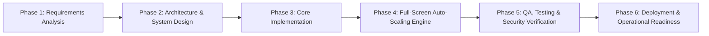

# 🎬 MCGI PRODUCTION MONITORING SYSTEM
### State-of-the-Art Attendance, Gathering Monitoring & Dedicated Logger System

[](https://github.com)
[](https://github.com)
[](LOGIN_NEAT_BACKGROUND.md)
[](https://github.com)
[](https://github.com)
[](https://github.com)

---

## 📌 Executive Summary

The **MCGI Production Monitoring System** is a mission-critical, enterprise-grade attendance tracking and broadcast duty monitoring application engineered specifically for **MCGI Productions**. It unifies personnel management, church gathering attendance recording, indoctrination guest tracking, real-time KPI visualization, automated risk analysis, cryptographic QR code attendance scanning, and strict role-based access control (RBAC) into a cohesive, responsive, and resilient software solution.

Styled in the official **MCGI Productions** brand design language—combining **Midnight Cosmic Onyx (`#050507`)**, **Sapphire Metallic Blue (`#18181b` / `#3f3f46`)**, and **Radiant Golden Amber (`#f59e0b` / `#fbbf24`)**—the system launches automatically in true full-screen mode and operates seamlessly across all form factors: mobile smartphones, tablets, laptops, and high-resolution 4K/2K desktop workstations without requiring manual window resizing.

---

## 📑 Table of Contents

1. [Full Development Lifecycle Overview](#-1-full-development-lifecycle-overview)
2. [Phase 1: Requirements Engineering & Operational Context](#-2-phase-1-requirements-engineering--operational-context)
3. [Phase 2: Architectural Decisions & System Design](#-3-phase-2-architectural-decisions--system-design)
4. [Phase 3: Module Implementation Details](#-4-phase-3-module-implementation-details)
5. [Phase 4: Responsive Full-Screen & Display Auto-Scaling Engine](#-5-phase-4-responsive-full-screen--display-auto-scaling-engine)
6. [Phase 5: Verification, Quality Assurance & Security](#-6-phase-5-verification-quality-assurance--security)
7. [Phase 6: Setup, Installation & Deployment Instructions](#-7-phase-6-setup-installation--deployment-instructions)
8. [Phase 7: Maintenance, Backup & Data Recovery](#-8-phase-7-maintenance-backup--data-recovery)
9. [Project Directory Structure](#-9-project-directory-structure)

---

## 🔄 1. Full Development Lifecycle Overview



The system was developed under a disciplined, iterative software engineering methodology:
1. **Domain Requirements Discovery**: Analyzing church gathering rhythms, personnel hierarchy across local units, and field requirements.
2. **Architectural Blueprints**: Choosing a zero-backend, client-side SPA with offline `localStorage` persistence, dual web/native desktop runtimes, and hardware-accelerated WebGL visuals.
3. **Core Development**: Constructing the operational modules, dedicated attendance logger engine, dynamic conditional form engines, interactive Chart.js analytics, and cryptographic QR code validation.
4. **Fluid Full-Screen Engine**: Implementing dynamic viewport units (`100dvh`), safe-area insets, HTML5 Fullscreen API hooks, and auto-fullscreen desktop launchers (`--start-fullscreen`, Win32 API display resolution detection).
5. **Quality Assurance & Verification**: Rigorous cross-browser, cross-device scaling audits, RBAC isolation, anti-replay attack verification, CSV injection prevention, and offline resilience stress-tests.
6. **Deployment Packaging**: Providing 1-click Windows shortcuts, batch launchers, Electron integration, and static web hosting readiness.

---

## 🎯 2. Phase 1: Requirements Engineering & Operational Context

### 2.1 The Operational Problem
MCGI Productions operates continuously across multiple church gatherings, live broadcasts, satellite viewing sessions, and community outreaches. Personnel are deployed across various locales:
- **Naic**
- **Calubcob**
- **Acacia**

Prior workflows faced challenges:
- Fragmented attendance tracking across manual paper sheets or disparate chat groups.
- Lack of centralized tracking for Special Gatherings, Multiple Viewing Batches, and Mass Indoctrination guest headcounts.
- Difficulty monitoring trainee progress, call-time adherence (late arrivals), and cumulative attendance rates.
- Inability to quickly operate in areas with intermittent internet access during remote broadcasts.

### 2.2 Operational Gathering Specifications & Dynamic Rules
The system natively supports 18 specific church gatherings and activities with dynamic conditional fields:

| Event Type | Conditional Field Behavior | Default / Preset Slots |
| :--- | :--- | :--- |
| **`PM`** (Prayer Meeting) | 5 schedule slot pill selectors | `3:30AM/WED - LIVE`, `2:30PM/WED - VIEWING`, `5:30PM/WED - VIEWING`, `7:00AM/THU - VIEWING`, `7:00PM/THU - VIEWING` |
| **`WS`** (Worship Service) | 4 schedule slot pill selectors | `3:30AM/SAT - LIVE`, `11:30AM/SAT - VIEWING`, `1:30PM/SUN - VIEWING`, `5:30PM/SUN - VIEWING` |
| **`PBB`** (Pasalamat ng Buong Bayan) | 3 schedule slot pill selectors | `4:00PM/SAT - LIVE`, `5:30AM/SUN - VIEWING`, `5:30PM/SUN - VIEWING` |
| **`COMBINED PM/WS`** | 5 schedule slot pill selectors | `3:30AM/WED - LIVE`, `2:30PM/WED - VIEWING`, `5:30PM/WED - VIEWING`, `7:00AM/THU - VIEWING`, `7:00PM/THU - VIEWING` |
| **`SPBB`** (Special PBB) | 3-day multi-day schedule slots | `DAY 1/FRI - 4:00PM`, `DAY 2/SAT - 4:00PM`, `DAY 3/SUN - 4:00PM` |
| **`MASS INDOCTRINATION`** | 14-Day individual check matrix + Guest count | `DAY 1` through `DAY 14` checkboxes + numeric **Number of Guests** counter |
| **`SERBISYONG KAPATIRAN`** | Edition selection & duty status | **Edition**: `AFTERNOON - 12:50PM`, `EVENING - 9:30PM`<br>**Status**: `PRESENT`, `ABSENT` |
| **`OTHER EVENT`** | Custom text input | Free-form event name input |
| **Other Standard Gatherings** | Standard logging | `CHRISTIAN NEW YEAR`, `LORD'S SUPPER`, `SENIORS' DAY`, `OPLAN DALAW TUPA (HARANA SA KAPATID)`, `MASS ORIENTATION`, `MEDICAL MISSION`, `BIBLE STUDY`, `GENERAL ASSEMBLY`, `FEEDING PROGRAM`, `MEETING` |

### 2.3 Personnel Hierarchy & Roles
- **`MUNICIPAL PROD`**: Senior production personnel overseeing municipal operations and broadcast execution.
- **`LOCALE PROD`**: Dedicated locale production crew responsible for equipment, cameras, and monitoring.
- **`TRAINEE`**: Apprentices undergoing technical training across sound, video, and streaming.

---

## 🏛️ 3. Phase 2: Architectural Decisions & System Design

### 3.1 Architectural Paradigm: Client-Side Single Page Application (SPA)
- **Decision**: Build the application using modern Vanilla JavaScript (ES6+), HTML5 semantic markup, Tailwind CSS utility layers, and CSS Custom Properties with zero mandatory backend server dependencies.
- **Rationale**: 
  - **Zero-Latency Offline Reliability**: In production booths or remote locations, network dropouts must never impede attendance logging or kiosk terminal operations.
  - **Single Source of Truth**: All operations execute instantaneously in-browser, reading and writing to a reactive `AppState` layer persisted in `localStorage`.
  - **Instant Deployment**: No database migrations, container orchestration, or server configuration needed for local operation.

### 3.2 State Management & Defensive Storage Engine
The application state is encapsulated in `window.AppState`:
```javascript
window.AppState = {
  members: safeJSONParse('mcgi_members', DEFAULT_MEMBERS),
  authUsers: safeJSONParse('mcgi_auth_users', DEFAULT_AUTH_USERS),
  currentUser: safeJSONParse('mcgi_current_user', null),
  attendance: safeJSONParse('mcgi_attendance', generateInitialAttendance()),
  eventEntries: safeJSONParse('mcgi_prod_event_entries', DEFAULT_EVENT_ENTRIES),
  leaves: safeJSONParse('mcgi_leaves', DEFAULT_LEAVES),
  settings: safeJSONParse('mcgi_settings', DEFAULT_SETTINGS),
  save() { ... }
};
```
- **Defensive Storage Parsing (`safeJSONParse`)**: Protects against unexpected `localStorage` corruptions, `null` references, or invalid JSON syntax by falling back gracefully to initial presets.
- **Complete Snapshot Export/Import**: Full state can be exported as a portable `.json` backup file or restored in one click from the Settings panel.

### 3.3 Hardware-Accelerated WebGL Shader Canvas
- **Decision**: Integrate a 3D animated fluid wave gradient on the authentication view (`login.html`) inspired by modern creative tech ([Neat Gradient](https://neat.firecms.co/)).
- **Implementation (`js/neat-gradient.js`)**:
  - Compiles raw WebGL GLSL vertex and fragment shaders.
  - Generates multi-octave 3D simplex noise with golden amber, sapphire blue, and obsidian onyx colors.
  - Pauses execution when the user enters the authenticated dashboard, ensuring **0% idle GPU utilization** during production monitoring.

### 3.4 Multi-Runtime Architecture (Web + Native Windows + Electron)
The system supports three native execution modes:
1. **Web SPA Mode**: Direct browser execution (Chrome, Edge, Firefox, Safari, Brave) or via lightweight local HTTP servers.
2. **Native Windows App Mode (`app_launcher.py`)**: 
   - Launches Chrome/Edge in standalone app mode (`--app=http://localhost:8080/index.html`).
   - Automatically injects high-resolution multi-size Windows icon (`app_icon.ico`) into the native taskbar window via Win32 API `WM_SETICON`.
   - Explicitly configures Windows `AppUserModelID` (`MCGI.Production.Attendance.System.1.0`).
3. **Electron Runtime (`electron_main.js`)**: 
   - Cross-platform desktop shell utilizing Chromium and Node.js.

---

## 💻 4. Phase 3: Module Implementation Details

### 4.1 Authentication & Sliding Glassmorphism Module (`login.html`)
- **Single-Card Sliding Track**: Smooth transition between **Sign In** and **Create Account** forms utilizing `transform: translateX(...)` with `cubic-bezier(0.16, 1, 0.3, 1)`.
- **Demo Quick-Login**: 1-click button to authenticate as *Bro. Paul (`paul` / `123!`)*.
- **Validation**: Strict password confirmation, minimum length checks, and shake-animated error alerts.
- **Registration**: Allows onboarding new personnel with Full Name, assigned Locale (`Naic`, `Calubcob`, `Acacia`), and Level (`MUNICIPAL PROD`, `LOCALE PROD`, `TRAINEE`).

### 4.2 Live Dashboard & Production KPIs (`panel-dashboard`)
- **Live Digital Clock**: Real-time 12-hour/24-hour Philippine Time display with animated live pulsing indicator.
- **Interactive Metric KPI Cards**:
  - *Total Personnel* (Registered member count)
  - *Present Today* (On-duty check-ins)
  - *Late Arrivals* (Check-ins logged after the designated call-time cutoff, e.g. 08:00 AM)
  - *Absent* (Pending or unaccounted personnel)
  - *Excused* (Personnel with approved leave requests)
- **Deep-Dive Drilldown Modal**: Clicking any KPI card opens a comprehensive modal listing the exact personnel in that status, complete with time in, remarks, locale filters, and one-click CSV export.
- **Chart.js Analytics**:
  - 7-Day Attendance Rate Trend with golden area fill.
  - Locale/Unit Attendance Comparison Bar Chart.
  - Active Session Status Distribution Doughnut Chart.

### 4.3 Attendance Entry Module (`panel-event-entry`)
Directly beneath the dashboard in the navigation hierarchy, this module is dedicated solely to recording attendance:
- **Refactored Single Action UI**: In accordance with enterprise separation of concerns, the Attendance Entry UI does not display any attendance-record tables or lists; it exposes a single, streamlined **"Record Attendance"** form action.
- **Auto-Fill Personnel**: Text input with real-time fuzzy auto-complete from the active roster.
- **Interactive Checkbox Pills**: Styled radio-checkbox toggles for Locales and Levels.
- **Dynamic Conditional Inputs**: Automatically renders schedule slot pills, 14-day indoctrination matrices, guest counters, or edition selectors depending on the selected event.
- **Direct Recording Persistence**: Submitting the form persists entries into `AppState.eventEntries` and notifies the dedicated `AttendanceLogger` module.

### 4.4 Dedicated Attendance Logger Module (`panel-attendance-logger` & `js/attendance_logger.js`)
All attendance-record-related functionality has been extracted into this dedicated, high-performance module:
- **Comprehensive Records Ledger**: Real-time table displaying all recorded gathering attendance entries, duty assignments, and QR scan events.
- **Summary Metrics Dashboard**:
  - *Total Recorded* entries count
  - *Indoctrination Guests* aggregate tally
  - *Municipal Prod* attendance count
  - *Trainee* attendance count
- **Advanced Multi-Dimensional Filtering**: Real-time search with diacritics/accent-insensitivity, event type dropdown filter, locale filter, and level filter.
- **Formula-Injection-Safe CSV Export**: Sanitized CSV export escaping potential formula injection triggers (`=`, `+`, `-`, `@`).

### 4.5 Personal Profile & Credential Security (`panel-my-profile`)
- **Admin & Member Account Management**: Exposes full personal details (Full Name, Email, Locale, Rank) and credential management (Username and Password update).
- **Internal Cryptographically Signed QR Code**: Each profile contains an internal QR code generated with a deterministic cryptographic signature (`mid|roll|email|SALT`):
  ```json
  {
    "mid": "PROD001",
    "roll": "PROD-NAIC-01",
    "sig": "3F9B1E4A"
  }
  ```
- **Programmatic & Non-Printable**: The QR code is stored internally with the member profile and rendered for scanning on device screens only. Printable QR badges have been eliminated to enhance credential integrity.

### 4.6 Member Touchless Camera Attendance Scanner (`panel-member-scan`)
- **Camera QR Scanner**: Hardware-accelerated webcam scanner using `html5-qrcode` mounted in `#memberCameraScanWrapper`.
- **Public API Function**:
  ```typescript
  AttendanceLogger.recordAttendanceFromQR(memberQr: string): Promise<{ success: boolean, message: string, member?: object, record?: object }>
  ```
- **Two-Tier Anti-Replay Protection**:
  1. *Session Debounce*: In-memory cache preventing duplicate scans of the same member within 30 seconds.
  2. *Daily Check-In Ledger Check*: Prevents double check-in for the same member on the active calendar date.
- **Signature Authenticity**: Verifies cryptographic hash to detect tampered or forged QR payloads.

### 4.7 Attendance Marking Sheet (`panel-attendance`)
- **Date Navigation**: Select any past or future date to review or record attendance.
- **Inline Status Buttons**: One-click **P** (Present), **L** (Late), **A** (Absent), and **E** (Excused) toggles with color-coded badges.
- **Bulk Actions**: **Mark All Present** and **Mark All Absent** for rapid batch processing.
- **Inline Remarks**: Live text input for duty remarks (e.g. "On technical booth", "Camera operator 2").

### 4.8 Production Roster Directory (`panel-roster`)
- **Directory Grid**: Visual cards for every production crew member with initials badge, locale, role, and contact email.
- **Member Profile History Drawer**: Clicking any card slides out an individual profile detailing overall attendance rate, total present/late/absent counts, and chronological attendance logs.
- **Roster Management**: Add new members or edit existing details with automatic state persistence and internal cryptographic QR generation.

### 4.9 Leave & Excuse Manager (`panel-leaves`)
- **Request Form**: Submit formal leave requests specifying personnel, date range, leave type (*Medical, Family, Shift Conflict, Official Church Duty*), and detailed reason.
- **Approval Workflow**: Admins can approve or reject requests. Approved leaves automatically propagate to the Attendance Sheet and mark the member as **Excused**.

### 4.10 Reports & Cumulative Analytics (`panel-reports`)
- **Cumulative Summary Ledger**: Calculates total present, late, absent, and excused sessions across all recorded dates for each personnel.
- **Low Attendance Risk Badging**: Personnel falling below the configurable attendance threshold (default < 75%) are automatically tagged with a glowing **"At Risk"** alert badge.
- **Formula-Injection-Safe CSV Export**: Exports sanitized CSV files preventing CSV injection attacks.

### 4.11 Role-Based Access Control (RBAC Architecture)
The application enforces strict separation between Administrator and Production Member accounts:
- **Admin Accounts (e.g. `paul` / `123!`)**:
  - Full personal details and associated stored QR code.
  - Access to all modules: Dashboard, Record Attendance, Attendance Logs, Attendance Sheet, Production Members, Leave & Excuses, Reports & Analytics, Admin Settings, and My Profile.
- **Member Accounts (e.g. `maria` / `123!`)**:
  - Username & password for authentication.
  - View **only their own profile** information and stored personal QR code.
  - Touchless camera scan interface to log attendance.
  - Standard members **cannot** view attendance-record tables, other members' data, roster management, or administrative settings. Route guards actively redirect unauthorized tab access to `my-profile`.

---

## 📱 5. Phase 4: Responsive Full-Screen & Display Auto-Scaling Engine

A critical requirement of the MCGI Production Monitoring System is that **the application automatically scales to fill the entire screen on any device or display size**, providing an immersive, responsive, full-screen experience without requiring manual window resizing.

### 5.1 Viewport & Layout Architecture (`css/custom.css`)
```css
html {
  height: 100%;
  width: 100%;
  overflow-x: hidden;
  -webkit-text-size-adjust: 100%;
}

body {
  min-height: 100%;
  min-height: 100vh;
  min-height: 100dvh;
  width: 100%;
  margin: 0;
  padding: 0;
  display: flex;
  flex-direction: column;
}

#appContainer {
  width: 100%;
  width: 100vw;
  height: 100vh;
  height: 100dvh;
  max-height: 100dvh;
  display: flex;
  flex-direction: column;
  overflow: hidden;
}
```

### 5.2 Responsive Breakpoint Strategy
- **Desktop & Workstations (≥ 768px, 1080p, 2K, 4K UHD)**:
  - Layout switches to `flex-direction: row`.
  - `#mainSidebar` occupies full viewport height (`100dvh`) with its own independent scrollbar.
  - `<main>` occupies `flex: 1 1 0%` and `height: 100dvh`, containing the sticky header and independently scrolling workspace canvas.
  - **Zero double scrollbars**: The browser window remains fixed, eliminating awkward outer body scrolling.
- **Smartphones & Small Tablets (< 768px)**:
  - `#appContainer` transitions to fluid vertical layout.
  - `#mainSidebar` transforms into a touch-friendly off-canvas drawer with smooth slide-out animation (`translateX(0)` vs `translateX(-100%)`) and blurred backdrop.
  - Safe-area insets (`env(safe-area-inset-top)`, `env(safe-area-inset-bottom)`) ensure content is not obscured by mobile notches, dynamic islands, or navigation bars.
- **Dedicated Login Scaling (`login.html`)**:
  - Uses `min-height: 100dvh` with centered flex alignment.
  - On short or landscape screens (e.g. phones in landscape mode), `overflow-y: auto` gracefully activates so form fields are never clipped.

### 5.3 Automatic Full-Screen Engine & Native HTML5 Integration
The application launches automatically in true full-screen mode on every device without requiring a manual toggle button:
- **Button-Free Design**: The manual "Full-Screen" toggle button has been removed from the header. The app automatically enters fullscreen upon opening.
- **Immediate Launch & Gesture Latching**: Modern browser security prevents unsolicited programmatic fullscreen without user gesture; the app attempts immediate `requestFullscreen()` on load and latches onto the first user interaction (`click`, `touchstart`, `pointerdown`, `keydown`) to seamlessly expand full-viewport if blocked.
- **Orientation & Dynamic Viewport Invariance**: On tablets and mobile phones, `orientationchange` and `resize` listeners automatically maintain immersion and re-trigger auto-fullscreen without clipping.
- **Keyboard Shortcut (`F11`)**: Global keydown listener intercepts `F11` to trigger fullscreen scaling across all browsers.
- **Chart Auto-Reflow**: The `fullscreenchange` event automatically dispatches a resize signal to `ChartsModule.resizeCharts()`, dynamically re-rendering Chart.js canvases to match the new dimensions.

### 5.4 Automatic Full-Screen Desktop Launchers
- **Windows Launcher (`app_launcher.py`)**:
  Queries the primary display resolution via the Win32 API (`GetSystemMetrics`) and starts Chromium/Edge with `--start-fullscreen` and `--start-maximized`:
  ```python
  screen_w = ctypes.windll.user32.GetSystemMetrics(0)
  screen_h = ctypes.windll.user32.GetSystemMetrics(1)
  cmd = [
      browser_exe,
      f'--app={app_url}',
      '--start-fullscreen',
      '--start-maximized',
      f'--window-size={screen_w},{screen_h}',
      '--window-position=0,0',
      ...
  ]
  ```
- **Electron Shell (`electron_main.js`)**:
  Configured with `fullscreen: true` and calls `win.setFullScreen(true)` immediately before `win.show()`, eliminating white flashes and ensuring the window opens in complete fullscreen on launch.

---

## 🛡️ 6. Phase 5: Verification, Quality Assurance & Security

### 6.1 Testing Matrix & Display Verification
The application has been verified across multiple device profiles and screen resolutions:

| Device / Resolution Profile | Viewport (px) | Expected Behavior | Verification Status |
| :--- | :--- | :--- | :---: |
| **Mobile (Compact)** | 360 × 640 / 375 × 667 | Hamburger menu, full-width single column cards, swipeable tables | ✅ Verified |
| **Mobile (Standard)** | 390 × 844 / 414 × 896 | Edge-to-edge layout, safe-area notches padded, fluid touch targets | ✅ Verified |
| **Tablet (Portrait)** | 768 × 1024 / 810 × 1080 | Adaptive grid (2 cols), off-canvas sidebar drawer | ✅ Verified |
| **Tablet (Landscape)** | 1024 × 768 / 1180 × 820 | Full dual-panel layout, visible persistent sidebar | ✅ Verified |
| **Desktop (HD / 720p)** | 1280 × 720 / 1366 × 768 | Split view, responsive cards, sticky header | ✅ Verified |
| **Desktop (FHD / 1080p)**| 1920 × 1080 | Full multi-column grid, expanded chart canvas, zero outer scroll | ✅ Verified |
| **Workstation (2K QHD)** | 2560 × 1440 | High-DPI crisp fonts, wide data tables, auto-scaled KPI grid | ✅ Verified |
| **Workstation (4K UHD)** | 3840 × 2160 | WebGL canvas dynamic scaling, balanced typography | ✅ Verified |
| **Ultra-Wide (21:9)** | 3440 × 1440 | Fluid container distribution without dead margins | ✅ Verified |

### 6.2 Security & Defensive Coding Standards
1. **CSV Injection Prevention (`sanitizeCSVField`)**:
   Prepends an apostrophe (`'`) to any exported field beginning with dangerous formula characters (`=`, `+`, `-`, `@`), preventing malicious code execution when opened in Microsoft Excel or Google Sheets.
2. **XSS Protection**:
   Dynamic HTML outputs sanitize user inputs, and template literals escape inner quotes.
3. **Defensive Storage Isolation**:
   `safeJSONParse` prevents application crashes if local storage data is tampered with or malformed.
4. **WebGL Context Recovery**:
   `NeatGradientController` catches WebGL initialization failures and gracefully falls back to a 2D canvas context without throwing unhandled exceptions.

---

## 🚀 7. Phase 6: Setup, Installation & Deployment Instructions

### Prerequisites
- **For Web Use**: Any modern web browser (Google Chrome, Microsoft Edge, Mozilla Firefox, Apple Safari, or Brave).
- **For Desktop Launcher**: Python 3.8+ (included on most developer workstations).
- **For Electron Desktop App (Optional)**: Node.js 18+ and npm.

---

### Deployment Option 1: Native Windows Standalone App (Recommended)
This provides the best native experience with custom taskbar icons and auto-maximized window mode.

1. **Launch the Application**:
   Double-click **`Launch_MCGI_App.bat`** in the project root folder.
   *(Or run `python app_launcher.py` in your terminal).*
2. **Create a Desktop Shortcut (Optional)**:
   Double-click **`Create_Desktop_Shortcut.bat`**. This creates a high-res shortcut on your Windows Desktop pointing directly to the app with the official MCGI Productions icon.

---

### Deployment Option 2: Electron Desktop Application
To run as a native cross-platform Electron window:

```bash
# Navigate to the project root
cd MCGI-PROD-ATTENDANCE-MANAGEMENT-SYSTEM

# Install dependencies (if not already installed)
npm install

# Launch the Electron application
npm start
```

---

### Deployment Option 3: Lightweight Python HTTP Server
To run the web app through the included lightweight Python HTTP server:

```bash
python server.py
```
Open **`http://localhost:8080`** in any browser.

---

### Deployment Option 4: Static Web Server (Production Cloud Hosting)
Because the application is a 100% client-side SPA, you can deploy it to any static web host:
- **GitHub Pages**: Push the repository and set GitHub Pages source to the root branch.
- **Vercel / Netlify**: Connect the repository and set publish directory to `./`.
- **NGINX / Apache**: Copy all project files to your web root (`/var/www/html/`) with standard MIME types configured.

---

### Deployment Option 5: Direct File Execution (Zero Server)
Double-click **[`index.html`](index.html)** or **[`login.html`](login.html)** directly in File Explorer to open in your default browser.

---

## 🔑 Demo Credentials

| Role | Username / Email | Password | Assigned Locale | Assigned Level |
| :--- | :--- | :--- | :--- | :--- |
| **Administrator / Crew** | `paul` *(or `paul@mcgiprod.org`)* | `123!` | Naic | `MUNICIPAL PROD` |
| **Locale Crew** | `maria` *(or `maria.s@mcgiprod.org`)* | `123!` | Naic | `LOCALE PROD` |

> *Tip: On the Sign In page, click the **"Bro. Paul (Demo)"** quick-login button to instantly authenticate in one click.*

---

## 💾 8. Phase 7: Maintenance, Backup & Data Recovery

### 8.1 Exporting System Backup (JSON Snapshot)
1. Open the application and navigate to **System Settings** in the sidebar.
2. Scroll to the **Backup & Restore System Data** section.
3. Click **Export Data Backup (.JSON)**.
4. A file named `MCGI_Prod_Backup_YYYY-MM-DD.json` will download containing all members, credentials, attendance sheets, and event logs.

### 8.2 Restoring from a Backup
1. Navigate to **System Settings**.
2. Click **Import Backup (.JSON)**.
3. Select your previously exported `.json` snapshot file.
4. The system will validate the schema, restore all datasets into `localStorage`, and refresh the interface.

### 8.3 Resetting to Default Factory Presets
If demo data needs to be cleared or reset to initial defaults:
1. In **System Settings**, locate the **Reset System Data** card.
2. Click **Reset to Initial Defaults** and confirm the prompt.

---

## 📂 9. Project Directory Structure

```text
MCGI-PROD-ATTENDANCE-MANAGEMENT-SYSTEM/
├── css/
│   └── custom.css                # Core design system, fluid scaling & theme rules
├── js/
│   ├── app.js                    # Primary application controller & state engine
│   ├── attendance_logger.js       # Dedicated attendance recording & cryptographic QR logger module
│   ├── charts.js                 # Chart.js analytics & trend visualizers
│   └── neat-gradient.js          # WebGL 3D animated fluid wave gradient engine
├── app_icon.ico                  # High-resolution multi-size Windows app icon
├── app_launcher.py               # Standalone native launcher & Win32 icon injector
├── Create_Desktop_Shortcut.bat   # 1-click batch script to generate desktop shortcut
├── create_shortcut.py            # Win32 desktop shortcut generator script
├── electron_main.js              # Electron desktop process controller
├── favicon.ico                   # Browser favicon
├── generate_icon.py              # Icon generation script
├── index.html                    # Main authenticated production dashboard
├── Launch_MCGI_App.bat           # 1-click native desktop app batch launcher
├── login.html                    # Sliding auth & WebGL animated fluid login page
├── LOGIN_NEAT_BACKGROUND.md      # WebGL shader documentation & architecture notes
├── logo.png                      # Primary MCGI Productions high-res branding logo
├── logo-[16-192].png             # Multi-resolution icon assets
├── manifest.json                 # Web App Manifest for PWA installation
├── package.json                  # Node.js & Electron metadata
├── README.md                     # Full lifecycle documentation
└── server.py                     # Standalone Python local HTTP server
```

---

## ⚖️ License & Attribution
**MCGI Production Monitoring System** © 2026 MCGI Productions. Developed for internal production operations, attendance administration, and broadcast duty monitoring. All rights reserved.
